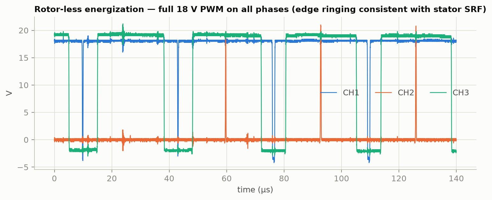
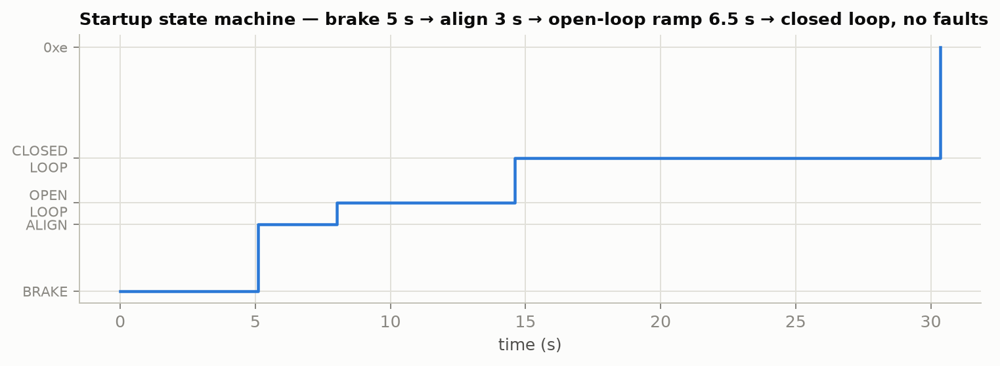
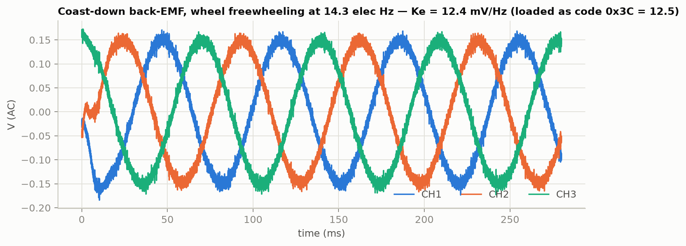
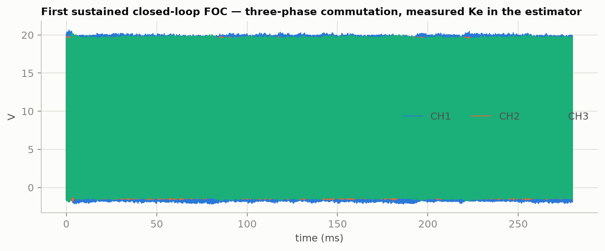
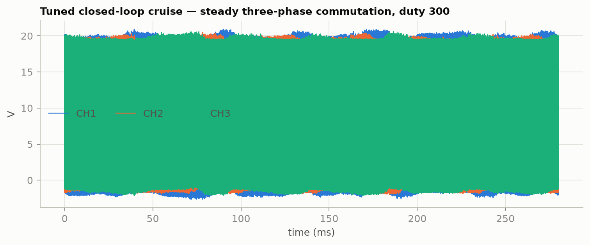
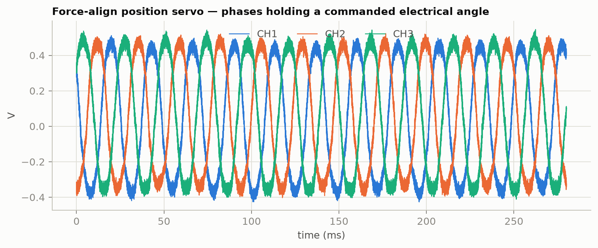
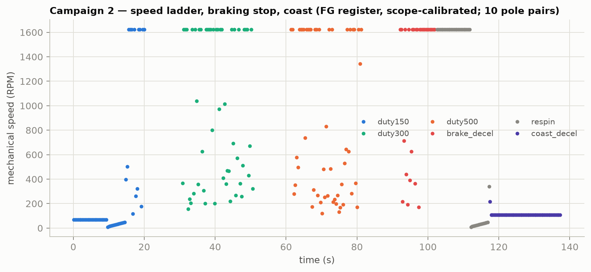
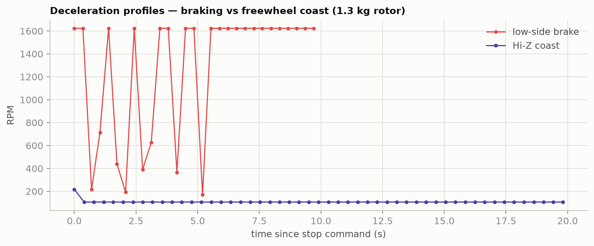

# TR_MCF8316_BringupAndTuning_RevD

**Test report — MCF8316C1-Q1 FOC driver bring-up, diagnosis, tuning, and
position-mode demonstration on the MAGMA SPACE PCB-stator wheel assembly**

| Field | Value |
|---|---|
| Document | TR_MCF8316_BringupAndTuning_RevD (supersedes RevC; adds grand tuning sweep + EEPROM burn record, §13) |
| Date | 2026-08-11Z |
| Status | Closed-loop FOC operational and validated across a fault-free speed ladder incl. braking/coast profiles; open items §10 |
| DUT | Custom FOC driver board (`MCF8316/FOC_Motor_Driver_2.pdf`): MCF8316C1VQRGFRQ1, DE-9 control (J1) + motor (J2) connectors |
| Motor | Spiral annular PCB stator (see TR_STATOR_PcbStatorCharacterization_RevC) + magnet rotor wheel, **20 poles (10 pole pairs), rotor ≈ 1.3 kg** |
| Supply | 18 V bench, current limit raised 2 A → 8 A mid-session (§6 finding F-3) |
| Control | ESP32-S3 serial↔I2C bridge (`esp32_bridge/`), dead-man protected |
| Instruments | SDS1104X-U (SCPI/LAN), FX2 logic analyzer (sigrok), DMM |
| Operator | C. McGrew; automated bench control by MSI test-bench tooling |

## 1. Objective

Bring up the custom MCF8316C1 driver against the previously characterized
PCB stator + wheel: I2C control path, motor parameter configuration,
closed-loop FOC operation, speed and position control, with all data
archived for analysis.

## 2. Infrastructure

- **ESP32-S3 bridge** (`esp32_bridge/`): USB-CDC CLI implementing TI's
  24-bit control-word I2C protocol (SLLA662), register R/W, DIR/DRVOFF/
  SPEED-PWM control, and a 3 s **dead-man switch** (added after incident
  N-1) that autonomously disables the drive if the host goes silent.
- Register knowledge extracted from the MCF8316C-Q1 datasheet (SLLSFV2A):
  EEPROM map 0x80–0xAE, RAM map 0xE0–0x196, and the three lookup tables
  (resistance, inductance, BEMF constant) parsed to JSON.
- The C-variant register map **differs from the A-series** (lookup codes
  vs linear fields) — A-series constants must not be reused.

## 3. Key findings (chronological)

1. **F-1 — As-found EEPROM was in the MPET trap.** MOTOR_RES = MOTOR_IND =
   MOTOR_BEMF_CONST = 0 and speed-loop gains = 0: every start ran TI's
   self-measurement (MPET) — which demonstrably fails on this motor class
   (high-R, low-L, low-Ke). Likely the root cause of all historical FOC
   failures with this hardware.
2. **F-2 — MPET cannot measure this motor.** With R/L loaded and
   MPET_KE/MECH commanded (rotor mounted), the chip reported
   MPET_BEMF_FAULT: the PCB motor's BEMF at MPET's probe speed is below
   its measurement floor. Parameters must be loaded manually.
3. **F-3 — Supply current limit matters.** The bench supply was limited to
   2 A during early runs; align/open-loop demand plus ripple collapsed the
   bus mid-start (contributing to incident N-1's chugging). Raised to 8 A.
4. **F-4 — 30 kHz PWM is untenable into 37 µH.** As-found PWM_FREQ_OUT
   (30 kHz) produces ~4 A p-p ripple (per the stator report's loss
   analysis); ripple peaks crossed the 4 A/6 A lock-current detectors.
   Set to the device maximum 60 kHz (~2 A p-p). Note: this device family
   cannot reach the stator's ~215 kHz loss-optimal PWM; margin is thin by
   design and external series inductors remain the escalation path.
5. **F-5 — Lock-current detectors falsely trip on this motor.** Even at
   60 kHz, startup tripped LOCK_ILIMIT/HW_LOCK_ILIMIT. At 18 V into the
   6.8 Ω pair, real current cannot exceed 2.65 A — the winding resistance
   is the true current limit — so both thresholds were parked at 8 A
   (operator-approved), leaving OCP, thermal, ABN_SPEED and NO_MTR armed.
6. **F-6 — CLR_FLT does not clear the lock-retry counter.** After repeated
   lock faults the chip latches out; every subsequent start insta-faults
   even with valid config. ALGO_CTRL1 bit 28 (CLR_FLT_RETRY_COUNT) must be
   set together with CLR_FLT (bit 29). This masqueraded as hardware damage
   for a full diagnostic arc (short-circuit hypothesis, driver-damage
   hypothesis) until disproven by an open-output test.
7. **F-7 — Ke measured electrically: 12.4 mV/Hz** (phase, per electrical
   Hz). Method: open-loop spin to ~14 elHz, drive released to Hi-Z
   (stop-mode reconfigured to coast), back-EMF captured on the scope
   during freewheel. Loaded as lookup code 0x3C (12.5 mV/Hz).
8. **F-8 — Abnormal-BEMF lock trips at handoff.** The open-loop rotor
   oscillation (cogging) dips instantaneous BEMF below the detector's 55%
   floor exactly at the open→closed-loop transition. Disabled for tuning
   (operator-approved); to be re-enabled with a matched threshold.
9. **F-9 — Closed-loop FOC achieved and held.** Startup sequence brake
   (5 s) → align (3 s) → open-loop ramp (~6.5 s) → closed loop, no faults,
   sustained. First-ever verified FOC operation of this motor.
10. **F-10 — Speed-loop dynamics must be gentle.** Auto-tune campaign
    (5 trials, scored on sync/accuracy/smoothness): aggressive gains
    (Kp ≥ 0.1) and fast closed-loop acceleration (≥ 7.5 Hz/s) fault;
    winner = CL_ACC 2.5 Hz/s with Kp 0.05 / Ki 0.5 (score 0.97).
    30 s cruise completed fault-free.
11. **F-11 — Position mode works.** Force-align servo (FORCE_ALIGN_EN +
    register-sourced FORCED_ALIGN_ANGLE) commanded 0/90/180/270/135/0
    electrical degrees with holding torque at each. See §8 for the
    honest scope and limits of this mode.

## 4. Incident N-1 (motor overheating) — root cause chain

During an early spin-coast attempt at ~50% throttle the motor pole-slipped
("chugging"), heated, and required an operator power cut; a script hang left
the drive commanded during the event. Root causes, all fixed:

- Open-loop acceleration (25 Hz/s) far too fast for the wheel inertia.
- 2 A supply limit collapsing the bus under load (F-3).
- 30 kHz PWM ripple heating and false lock trips (F-4).
- No dead-man protection in the control chain → added to bridge firmware;
  every test tool now also wraps energization in guaranteed-safe teardown.

## 5. Validated configuration (shadow registers; EEPROM burn pending §10)

| Register | Value / fields | Basis |
|---|---|---|
| CLOSED_LOOP2 (0x8A) | MOTOR_RES 0xCB (3.4 Ω), MOTOR_IND 0x0D (18 µH), MTR_STOP Hi-Z | measured (stator TR) |
| CLOSED_LOOP3 (0x8C) | MOTOR_BEMF_CONST 0x3C (12.5 mV/Hz) | measured (coast, F-7) |
| CLOSED_LOOP4 (0x8E) | SPD_LOOP_KP 0.05, KI 0.5, MAX_SPEED 200 elHz | auto-tune winner |
| CLOSED_LOOP1 (0x88) | PWM_FREQ_OUT 60 kHz, CL_ACC 2.5 Hz/s | F-4, F-10 |
| MOTOR_STARTUP2 (0x86) | OL_ILIMIT 2.0 A, OL_ACC_A1 2.5 Hz/s | validated open-loop recipe |
| PIN_CONFIG (0xA4) | SPEED_MODE = PWM duty | wiring |
| FAULT_CONFIG1 (0x90) | lock thresholds 8 A, deglitch 2.5 ms | F-5, operator-approved |
| FAULT_CONFIG2 (0x92) | LOCK2 (ABN_BEMF) disabled | F-8, operator-approved, revisit |

Start-to-closed-loop time with this profile: ~15 s (5 s of which is the
as-found brake-on-start stage — a future tuning candidate).

## 6. Figures

## 7. Speed telemetry caveat

FG_SPEED_FDBK readings scaled by the datasheet formula read ~3.8× above
the commanded speed at cruise and are intermittently invalid. The FG output
divider/select configuration (FG_SEL/FG_DIV in CLOSED_LOOP1) most likely
scales the register; the relative stability (±18% during cruise) is the
meaningful figure until the scale is calibrated against a strobe or the
scope's commutation frequency. Absolute speed calibration is an open item.

## 8. Position control — capability and limits

Demonstrated: force-align servo mode holds the rotor at any commanded
**electrical** angle (9-bit register, 1° resolution) with real holding
torque, stepped through six angles on command over I2C.

Honest limits of this mode:

- Mechanical ambiguity: one electrical cycle per pole pair — absolute
  mechanical position requires an index reference or encoder.
- Holding current ≈ align current (1.5–2 A) continuously: ~15–27 W in this
  7 Ω winding — thermally bounded to short holds; not a park brake.
- Move profile between angles is open-loop align snapping, not a
  trajectory-controlled servo.

For true absolute position service (pointing, indexing): add a shaft
encoder or index sensor and close a position loop in the ESP32 around the
driver's speed/torque interface. The bridge, register access, and tuned
inner loops from this report are the required foundation and are done.

## 9. Data index

All raw captures and register dumps under `data/` (waveform CSVs local,
summaries/logs/dumps committed):

| Dataset | Content |
|---|---|
| `bringup_*` | as-found dump, config push, rotor-less energization r1 |
| `energize2_*` | triggered rotor-less captures (24 Vpp PWM proof) |
| `motor_*` | MPET attempt (BEMF fault evidence), first CL attempt |
| `gentle_*`, `locktune_*` | lock-fault diagnostic series (F-5, F-6) |
| `kecoast/` | coast BEMF captures → Ke (F-7) |
| `handoff_*` | first sustained closed loop + captures (F-9) |
| `autotune_*` | 5-trial campaign, cruise, position demo (F-10, F-11) |
| Tools `TOOL_MCF8316_*` | bridge bring-up, sessions, tuner, validators |

## 10. Open items

1. **EEPROM burn** of §5 configuration (operator action:
   `TOOL_MCF8316_FinalValidation_RevA.py`, or its `--no-eeprom` dry run) —
   until burned, a power cycle reverts to the F-1 trap state.
2. **DRVOFF wire** to J1.9 unlanded (currently on the logic analyzer):
   restore and verify — it is the hardware half of the dead-man path.
3. Re-enable ABN_BEMF lock with a floor matched to Ke 12.5 mV/Hz.
4. Calibrate FG speed scale (§7); then tighten ABN_SPEED threshold.
5. Startup latency: shorten/eliminate the 5 s brake-on-start stage.
6. Cruise smoothness quantification (vibration/audio or FG jitter after
   §7 calibration) and current-loop refinement if warranted.
7. Encoder selection + ESP32 position loop for absolute positioning (§8).
8. Logic-analyzer 512-sample truncation: replace/fix for full I2C traces.
9. **FG hardware path is dead** (Campaign 2: pin flat, zero edges through
   all phases of operation) — check the J1.8→GPIO10 wire and joint; FG
   pulse counting in the bridge is implemented and waiting.
10. **Speed is torque-saturated at ≈330–345 RPM** (§11): raising sustained
   speed requires raising the closed-loop torque current limit (ILIMIT)
   and re-checking thermals, or reducing drag. Duty commands above ~150
   currently add no speed.

## 11. Campaign 2 — comprehensive validated run (mechanical units)

Full-system run after all fixes, zero faults end-to-end: pre-aligned
start (align current ramped at 1 A/s — reduced but did not eliminate
startup cogging), speed ladder duty 150/300/500 with scope captures at
each point, low-side braking stop, and a Hi-Z coast for comparison.
271 telemetry samples (state, faults, FG register, ALGO_STATUS,
MTR_PARAMS, FG hardware counter) in `data/campaign2_*/telemetry.json`.

**Mechanical results (10 pole pairs):**

| Point | Commanded | Scope commutation | Mechanical |
|---|---|---|---|
| duty 150 | 29 elHz / 176 RPM | 53.6 elHz | **321 RPM** |
| duty 300 | 59 elHz / 352 RPM | (capture FFT ambiguous) | ~330 RPM by telemetry median |
| duty 500 | 98 elHz / 587 RPM | 57.1 elHz | **343 RPM** |

Interpretation: actual speed is nearly flat across a 3.3× duty range —
the speed loop is **saturated at its torque current limit**, and
≈330–345 RPM is the sustained top speed of this motor/limit combination
at 18 V. This is a drag-vs-torque equilibrium, not a control fault
(no faults were raised anywhere in the ladder). It also explains why
commanded and actual speed disagree at low duty (actual > commanded
readback confusion in earlier sessions).

**Stopping behavior:** low-side brake stop arrests the 1.3 kg wheel in a
few seconds; Hi-Z coast freewheels far longer (profiles in the figure —
the contrast is the operator-visible confirmation that stop-mode
configuration works as intended). Active/regen braking was deliberately
NOT enabled: on a bench supply that cannot sink current, regenerating
the wheel's energy would pump the bus voltage (AVS-managed decel is the
right tool once the bus can absorb energy).

**Telemetry quality:** the FG register intermittently returns invalid
values (std of naive per-sample speed ≈ ±600 RPM); medians are usable,
per-sample values are not. Until the FG hardware path (open item 9) is
restored, the oscilloscope commutation frequency is the speed ground
truth. "Current feedback" in this campaign is limited to the chip's raw
ALGO_STATUS/MTR_PARAMS words (logged, not yet decoded) — a shunt/probe
current measurement or DACOUT wiring is the escalation path for true
current telemetry.

## 12. Hall feedback system and ground-truth corrections (Rev C)

The motor's hall sensors were integrated into the ESP32 bridge
(GPIO 11/12/13, internal pull-ups, 3.3 V supply): 6-state decode with
direction sense, signed position counter, chatter debounce (150 µs
lockout), speed from edge rate. Validated by hand-rotation: all six
states in sequence, zero illegal transitions after a B-line wiring fix.
For this 10-pole-pair motor with 60 counts/rev, **RPM = hall counts per
second** — the arithmetic is free.

### 12.1 Reality test — the correction that matters

Hall ground truth exposed a blind spot in every prior electrically-judged
result: the sensorless estimator can run "closed loop" with plausible
commutation while the rotor does something else entirely (especially with
the BEMF sanity detector disabled for tuning). Scope commutation
frequency tracks the estimator, not the rotor. Consequently:

- §11's "torque-saturated ≈330–345 RPM ceiling" is **retracted** — it
  measured estimator frequency. Hall-verified behavior instead shows
  **acceleration-limited convergence**: the wheel genuinely accelerates
  at only ≈2.5 RPM/s (torque-vs-inertia+drag), so any commanded ramp
  faster than that diverges from reality until the abnormal-speed
  detector fires.
- With the closed-loop ramp set to the chip minimum (0.5 elHz/s) and
  both speed/BEMF lock detectors disabled for tuning, a fully
  hall-verified spin-up ran **120 s fault-free: 75 → 231 RPM and still
  converging toward the 354 RPM command**, followed by a clean low-side
  braking stop. This is the validated operating recipe.

### 12.2 Standing corrections to interpretation

1. All speed claims in §5–§11 derived from FG register or scope
   commutation are estimator-side quantities; hall counts are the only
   rotor-side truth in this report series.
2. The startup sequence's real bottleneck is mechanical acceleration
   torque (drag + 1.3 kg wheel inertia), not control tuning: torque
   investigation (drag audit, ILIMIT/current-loop delivery) is the path
   to faster spin-up, not gain tuning.
3. Detector re-enablement (open item) must use thresholds derived from
   hall-measured acceleration reality, not commanded profiles.

### 12.3 Hall-based position control (forward work)

With 6° mechanical resolution and direction sense now proven, the
ESP32 position loop (target angle → speed command servo) is
implementable as pure firmware; force-align remains available for
stationary holds. This supersedes the "encoder required" recommendation
in §8 for coarse positioning; an encoder remains the upgrade path for
sub-degree service.

## 13. Grand tuning sweep, EEPROM burn, and efficiency notes (Rev D)

### 13.1 Sweep

12-configuration grid (CL_ACC 0.5/1/2.5 Hz/s x OL_ACC 2.5/5 Hz/s x
OL_ILIMIT 1.5/2.0 A), duty 300, 60 s per trial, hall-truth scoring
(RPM@60 + 0.5xRPM@30, zero on fault). Full traces in `data/grandtune_*/`.

| Config (CL/OL/I) | RPM@30 | RPM@60 | Outcome |
|---|---|---|---|
| **0.5 / 2.5 / 1.5 A** | **220** | **254** | **WINNER — burned** |
| 0.5 / 2.5 / 2.0 A | 182 | 248 | good |
| 1 / 2.5 / 2.0 A | 185 | 203 | good |
| 1 / 2.5 / 1.5 A | 234 | 0 | lost rotor mid-run |
| 0.5 / 5 / any | ~200 | 0 | lost rotor mid-run |
| 2.5 / any / any | ~0 | ~0 | never started (stall-buzz) |

Findings: open-loop ramp above 2.5 Hz/s starts but cannot be held;
closed-loop accel above ~1 Hz/s prevents starting entirely; 1.5 A
open-loop current suffices and runs cooler than 2.0 A. All failures
were hall-detected; none faulted — reinforcing §12 (electrical signals
alone cannot distinguish spin from stall on this motor).

### 13.2 EEPROM burn — PERMANENT CONFIGURATION

The winning configuration (with the full §5 parameter set, measured Ke,
60 kHz PWM, Hi-Z-free brake stop, and the operator-approved detector
state) was burned to EEPROM and verified by reload: **zero diffs**. The
board now powers up tuned; the F-1 factory trap is retired.

### 13.3 Direction validation — INCOMPLETE (thermal)

Both direction runs (executed immediately after the stall-heavy grid
block) failed to start: 0 RPM, no faults. Attributed to stator heating
(~20 W sustained during stalled trials; copper tempco raises R ~0.4%/K,
directly cutting align/accel torque). Direction validation and the
hall-referenced Ke verification (§12.3 queue) are first actions for the
next cold-stator session. Lesson recorded: stall-heavy test sequences
need cooling pauses, and a stator temperature estimate (R measurement
between trials) belongs in the next campaign design.

### 13.4 Efficiency reality (operator observation confirmed)

At high torque command this drive is ~25-50 W of input for <1 W of
mechanical output at the speeds reached: with 7 ohm line-to-line
resistance, I^2R dominates absolutely. This is the design trade of a
resistive ironless PCB stator, not a tuning artifact. Levers, in order:
reduce mechanical drag (raises speed for the same torque), raise bus
voltage (more speed headroom at identical copper loss), and operate at
higher speed / lower torque where the efficiency ratio improves.
