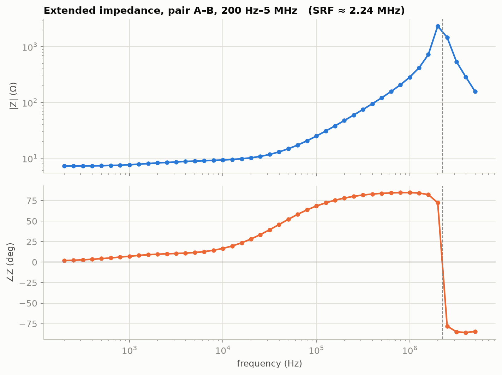
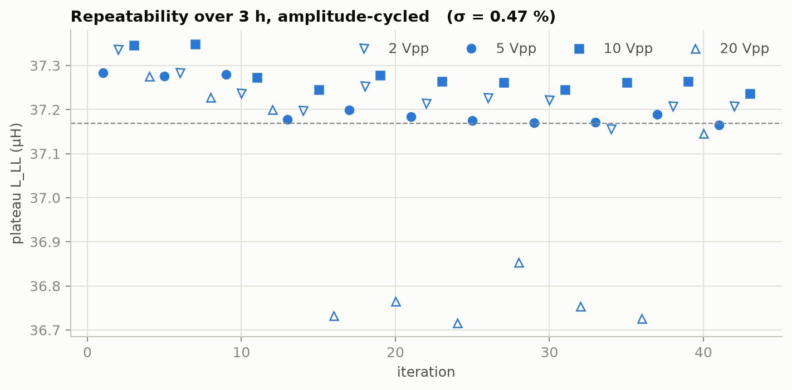

# TR_STATOR_PcbStatorCharacterization_RevB

**Test report — electrical characterization of spiral annular PCB stator**

| Field | Value |
|---|---|
| Document | TR_STATOR_PcbStatorCharacterization_RevB (supersedes RevA) |
| Date | 2026-08-10Z |
| Status | Pair A–B characterization COMPLETE (43-sweep loop). Pairs B–C / C–A, back-EMF constant, and §5.2 discriminating test pending → Rev C |
| DUT | 3-phase spiral annular PCB stator, wye-connected, 3 terminals (A/B/C) |
| DUT configuration | Bare stator board only — no rotor, magnets, or back-iron. Resting on wood (non-conductive) |
| Operator | C. McGrew; automated bench control by MSI test-bench tooling |

## 1. Objective

Full passive electrical characterization of the PCB stator: terminal-pair
impedance Z(ω), series inductance and resistance vs frequency, drive-amplitude
linearity, repeatability/drift over hours, mutual-coupling asymmetry of the
open phase, and location of the self-resonant frequency (SRF).

## 2. Instruments

| Instrument | Model | Serial | Interface |
|---|---|---|---|
| Oscilloscope | Siglent SDS1104X-U, fw 2.1.1.1.5R5 | SDSAHBAX5R1440 | SCPI raw socket, LAN 10.42.0.29 |
| Signal generator | JDS6600 (15 MHz variant) | 2366105039 | vendor serial protocol, /dev/ttyUSB0 |
| Sense resistor | metal film, **42.68 Ω** (DMM 4-wire-equivalent hand measurement) | — | — |

Scope vertical system is 8-bit; quantization is mitigated by sine excitation
and lock-in extraction (§3), not by averaging.

## 3. Method

Series V-I measurement with low-side current sense, all grounds common:

```
gen ── T ─────────────────────► terminal A     CH1 tip: terminal A (10x)
      └─ coax ► scope CH4 (1x)                 CH2 tip: B–Rsense junction (10x)
terminal B ──[ Rsense 42.68 Ω ]── gen return   CH3 tip: terminal C, open (10x)
                                               all probe grounds: Rsense gnd end
```

Per frequency point, automated (TOOL_STATOR_SweepOrchestrator_RevA.py):
generator set to sine at f; scope timebase set for ≥8 cycles; per-channel
vertical autoscale; single acquisition of all four channels; Hann-weighted
lock-in extraction of each channel's complex phasor at f₀ (f₀ refined by
maximizing the current-channel lock-in magnitude). Impedance from the phasor
ratio, in which the window scalar cancels exactly:

> Z_pair = Rs · (V₁ − V₂) / V₂

Derived per point: R = Re Z, L = Im Z / ω, and the open-phase asymmetry EMF
normalized to half the drive: emf_C = (V₃ − (V₁+V₂)/2) / ((V₁−V₂)/2). For a
wye winding with matched half-windings the star point sits at (V₁+V₂)/2, so
emf_C measures phase-C mutual/geometric asymmetry, not gross coupling.

**Method validation:** the extraction chain was verified against synthetic
Siglent-format captures of a known DUT (R = 7.000 Ω, L = 2000 µH) including
8-bit quantization and noise: recovery within 0.1 % (R) and 0.3 % (L) across
100 Hz–100 kHz (see repo history, `TOOL_STATOR_ImpedanceSweep_RevA.py`).

**Wye conversion:** a terminal pair measures L_LL = 2·(L_phase − M). Values
quoted "per phase" are L_LL/2 = L_phase − M — the commutation inductance seen
by an inverter leg. Separating L_phase from M requires the §7 multi-pair data.

## 4. DC baseline

Phase-to-phase DC resistance (DMM): **≈ 7.0 Ω** on each pair (≈ 3.5 Ω per
winding), consistent with thin-copper spiral traces. Equal pair readings are
consistent with a balanced wye; wye topology was confirmed electrically: the
open terminal C rides at the (V₁+V₂)/2 star midpoint within ~7 % (§5.3).

## 5. Results — run 1, pair A–B, 5 Vpp drive, 15 points, 1 kHz–1 MHz

Raw data: `data/run1_pairAB/` (per-point waveform CSVs + `summary.csv`).

### 5.1 Headline values

| Quantity | Value | Basis |
|---|---|---|
| L_LL (pair A–B) | **37.3 µH** | median of 20 kHz–300 kHz plateau (spread < 0.5 %) |
| L per phase (L−M, wye) | **18.7 µH** | L_LL / 2 |
| R_LL low-frequency | 7.6–8.3 Ω (1–2 kHz) | Re Z; DC value 7.0 Ω |
| R_LL mid-band | ≈ 9.1 Ω (20–100 kHz) | Re Z |
| R_LL at 1 MHz | 26 Ω | Re Z (skin/proximity/eddy) |
| Corner (∠Z = 45°) | ≈ 39 kHz observed | matches R/2πL = 34–39 kHz |
| Q at 300 kHz | ≈ 6.6 | ωL/R |
| SRF | **2.241 MHz ± 1.1 kHz** | §7.1, 43 iterations |


### 5.2 Low-frequency dispersion — eddy screening

Apparent series L falls from ≈ 156 µH (1 kHz) to the 37.3 µH plateau by
≈ 20 kHz while series R rises above its DC value. External-conductor eddy
screening is excluded: no rotor mounted, board resting on wood. Remaining
candidates, both matching the frequency signature (effect peaking at few
kHz, gone above ~20 kHz):

1. **Self-screening by the board's own copper.** Spiral traces are
   mm-scale wide; copper skin depth passes through that dimension across
   1–20 kHz (δ ≈ 2.1 mm at 1 kHz, 0.46 mm at 20 kHz). Eddy currents
   circulating within the trace widths — on all layers, including the
   open phase — progressively expel flux from the copper: L falls, and
   the reflected loss raises R (consistent with R: 7.0 Ω DC → 9.1 Ω
   mid-band). A known effect in PCB machines with wide traces; the
   mitigation in fabrication is multiple narrow paralleled traces.
2. **Probe compensation mismatch (CH1 vs CH2)** — a miscompensated 10×
   probe introduces phase errors of a few degrees peaked in the same
   band, and the extraction is phase-limited at low f where ∠Z is small
   (excess phase observed: 5.5° at 1 kHz).

Discriminating tests (post-loop, minutes): verify both probe compensations
on the scope cal output; re-measure with a known pure resistor as DUT (a
comp artifact reproduces on a resistor, real self-screening does not);
swap CH1/CH2 probes (an artifact moves/flips, physics stays). Either way
the design-relevant value for PWM-rate ripple is the **plateau L**, which
is insensitive to both mechanisms.

### 5.3 Open-phase asymmetry


|emf_C| is 6–7 % of half-drive at low frequency, decaying above the corner.
A perfectly symmetric wye with identical mutuals M_AC = M_BC would null this
quantity; the observed asymmetry is small and stable. Single rotor position;
angle dependence not yet measured.

## 6. Uncertainty

Dominant terms, quoted for the plateau L_LL:

- Rsense value: DMM accuracy on 42.68 Ω, est. ±0.5 % → ±0.5 % on |Z| and L.
- Probe/channel gain mismatch (CH1 vs CH2, 10× probes, compensation state
  not formally verified): est. ±2 % on |Z|; largely cancels in ∠Z.
- Extraction: < 0.3 % (validated, §3).
- Quantization/noise at plateau signal levels: < 0.5 % after lock-in.

Combined (RSS): **≈ ±2.2 % on L_LL** → L_LL (A–B) = **37.3 ± 0.9 µH**.
R values below the corner carry the same scale factors; R above ∠Z ≈ 85°
(≥ 700 kHz) is ill-conditioned and indicative only.

## 7. Long-run comprehensive loop — RESULTS

43 complete sweeps over 3.0 h (2026-08-10 20:39–23:41 Z), 45 points each,
200 Hz–5 MHz, amplitude cycled 5/2/10/20 Vpp, zero failed iterations.
Data: `data/loop1_pairAB/` (per-iteration summaries committed).

### 7.1 Self-resonance



Clean parallel self-resonance: **SRF = 2.241 MHz ± 1.1 kHz** (found in
43/43 iterations; the ±1.1 kHz spread over 3 h demonstrates both DUT and
bench stability). |Z| peaks ≈ 2.3 kΩ; phase transitions +82° → −80°.
Equivalent parallel capacitance C_p = 1/(L·(2π·SRF)²) ≈ **136 pF**, of
which an estimated 15–30 pF is probe/fixture loading, so the winding's own
interwinding capacitance is ≈ 105–120 pF.

### 7.2 Amplitude linearity

| Drive | n | plateau L_LL (µH) | R mid-band (Ω) |
|---|---|---|---|
| 2 Vpp | 11 | 37.231 ± 0.045 | 9.169 ± 0.056 |
| 5 Vpp | 11 | 37.206 ± 0.046 | 9.090 ± 0.022 |
| 10 Vpp | 11 | 37.275 ± 0.036 | 9.061 ± 0.011 |
| 20 Vpp | 10 | 36.940 ± 0.228 | 8.982 ± 0.011 |

2–10 Vpp agree within 0.2 % — the winding is linear, as an air-core must
be (no core to saturate). The 20 Vpp group reads ~0.9 % low with ~5×
the scatter; attributed to generator output-stage strain driving 20 Vpp
into the ~10–50 Ω load (source distortion inflates the lock-in reference
subtraction), not to the DUT. Even taken at face value the current
dependence is bounded at ≈ 1 %.

### 7.3 Repeatability / drift



Across all 43 iterations and 3 h: plateau L_LL = **37.17 µH, σ = 0.47 %**
(σ = 0.12 % within the 2–10 Vpp groups). No monotonic drift → no thermal
sensitivity observable at these excitation levels.

## 7a. Drive implications (18 V bus, MCT8316Z or similar)

- Winding pair as seen by a trapezoidal driver: R = 7.0 Ω DC / ≈ 9.1 Ω at
  PWM-relevant frequencies; L = 37.2 µH; SRF 2.24 MHz.
- PWM frequency: ripple loss falls ∝ R(f)/f² and is still falling at
  1 MHz; the practical ceiling is switching loss (bridge-dependent) and
  SRF/5 ≈ **450 kHz**. With the MCT8316Z (200 kHz max): run at 200 kHz —
  ripple ≈ 0.60 A pp at 18 V, ≈ 0.3 W ripple heat, negligible vs
  conduction. A GaN bridge could exploit 400–450 kHz; beyond that the
  interwinding capacitance takes over.
- 18 V stall current into 7 Ω is ~2.6 A → ~47 W board heating: driver
  current limit must protect the copper (start 1–1.5 A, thermal-test up).
- FOC parameter set (per phase): Rs = 3.5 Ω, Ld = Lq = 18.7 µH, no
  saliency; Ke TBD (Rev C spin test). Enter manually — parameter autotune
  routines generally fail on this motor class.

## 8. Findings & recommendations

1. **F-1:** Pair A–B behaves as a clean series R-L with L_LL = 37.3 µH
   (plateau) and no SRF below 1 MHz. Suitable frequency range for inverter
   ripple analysis: use plateau L.
2. **F-2:** Strong low-frequency L dispersion; external conductors excluded
   (bare board on wood). Leading candidate: self-screening by the board's
   own wide copper traces; alternative: probe-compensation phase error
   (§5.2). Action: probe-comp check, known-resistor DUT, probe swap.
   Plateau values unaffected. If self-screening is confirmed it is a real
   DUT property worth noting for any low-frequency (sub-corner) use.
3. **F-3:** Wye topology confirmed electrically; phase-C asymmetry ≤ 7 %.
   Action: repeat at several locked rotor angles to map saliency.
4. **F-4:** SRF = 2.241 MHz (C_p ≈ 136 pF incl. fixture); winding linear
   within ≤1 % over 2–20 Vpp; L repeatable to 0.47 % over 3 h with no
   drift. PWM ceiling SRF/5 ≈ 450 kHz; recommended operating point with
   MCT8316Z at 18 V: 200 kHz PWM, current limit 1–1.5 A initial (§7a).
5. **N-1 (process):** Incident during initial manual capture (USB file
   SDS00004.csv): both scope probes were on generator outputs (4 kHz and
   10 kHz on the JDS6600's two channels), yielding no DUT response.
   Detected by frequency fingerprint and −70 dB cross-lock-in. Mitigation
   now automated: every sweep point verifies the sense-channel frequency
   equals the drive frequency by construction (lock-in at f₀ from CH2).

## 9. Data & tooling index

| Path | Content |
|---|---|
| `TOOL_STATOR_SweepOrchestrator_RevA.py` | single sweep: gen + scope + lock-in |
| `TOOL_STATOR_SweepLoop_RevA.py` | multi-hour loop, amplitude cycle |
| `TOOL_STATOR_ImpedanceSweep_RevA.py` | offline analysis of saved scope CSVs |
| `TOOL_STATOR_ReportFigures_RevA.py` | figures in `figures/` from summary.csv |
| `TOOL_STATOR_LoopStats_RevA.py` | loop aggregation: SRF, linearity, repeatability |
| `data/run1_pairAB/summary.csv` | run-1 per-point table (committed) |
| `data/loop1_pairAB/` | loop output (waveform CSVs local-only, summaries committed) |
