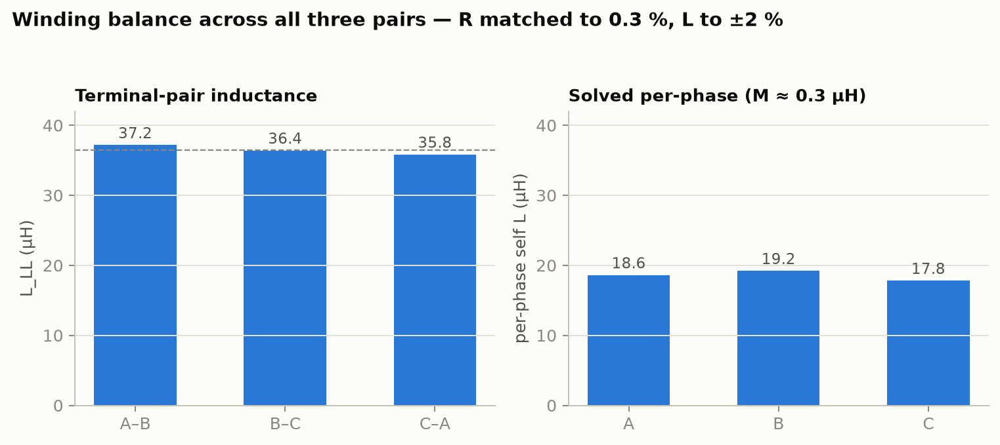
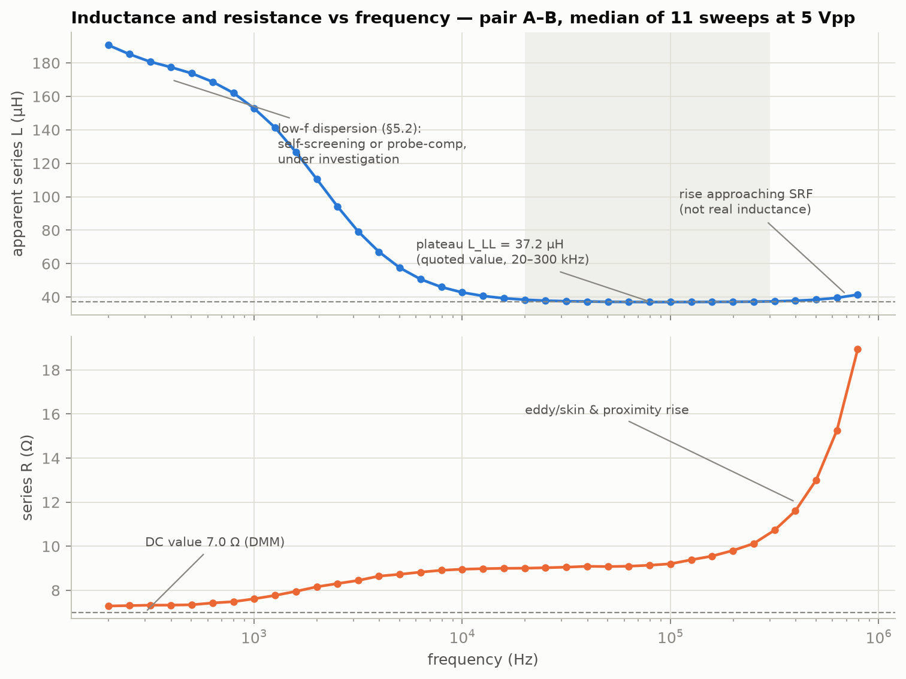
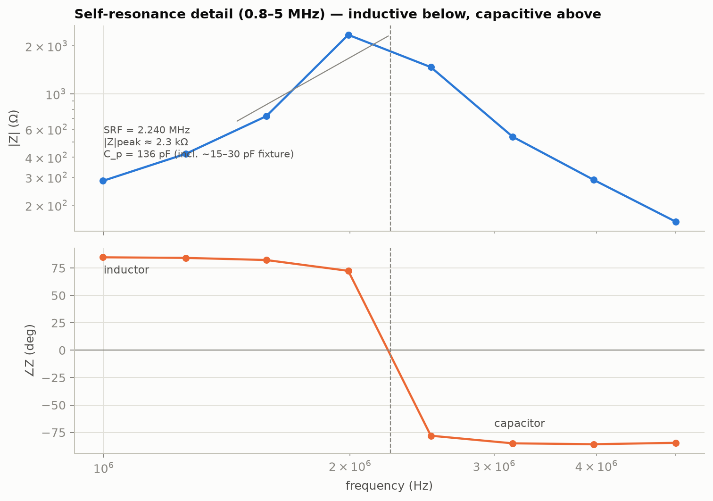
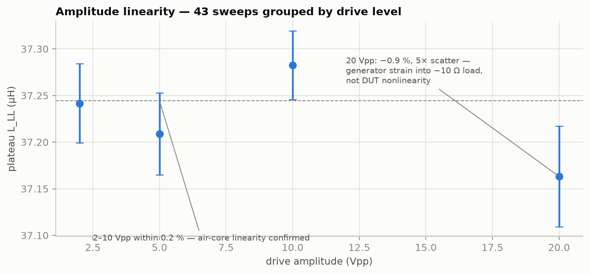
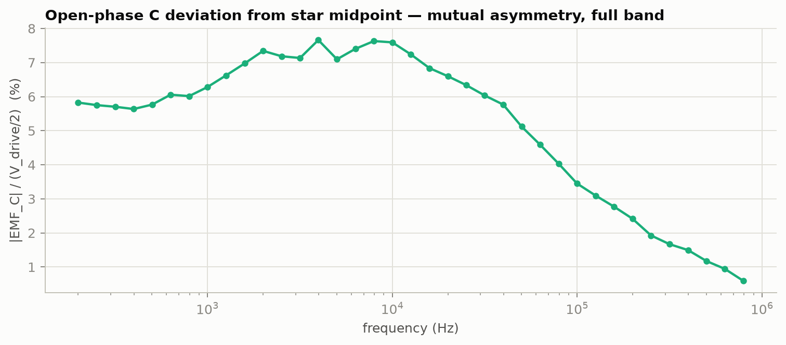
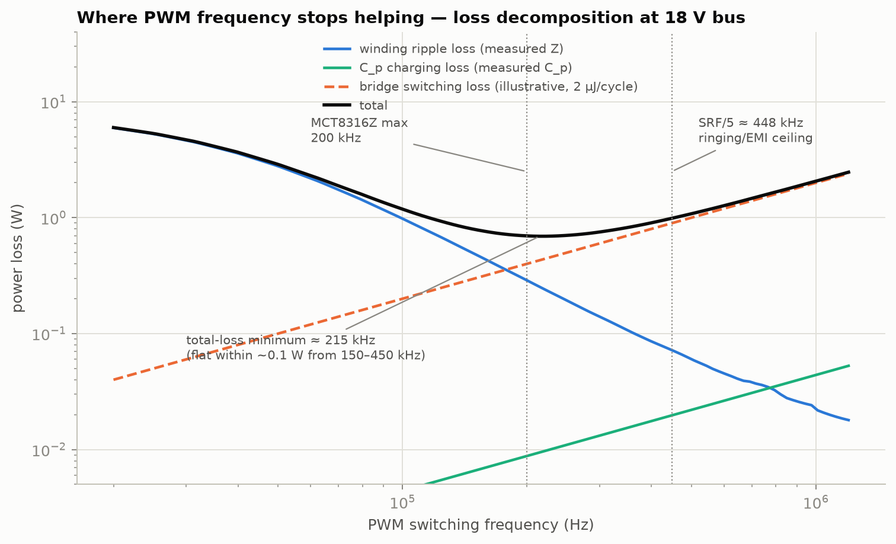

# TR_STATOR_PcbStatorCharacterization_RevC

**Test report — full electrical characterization of spiral annular PCB stator**

| Field | Value |
|---|---|
| Document | TR_STATOR_PcbStatorCharacterization_RevC (supersedes RevB) |
| Date | 2026-08-11Z |
| Status | ISSUED — all three terminal pairs characterized; back-EMF deferred to final-rotor assembly (§11); residual open items §13 |
| DUT | 3-phase spiral annular PCB stator, wye-connected, terminals A/B/C |
| DUT configuration | Bare stator board, no rotor/magnets/back-iron mounted (except §11 spin test), resting on wood |
| Operator | C. McGrew; automated bench control by MSI test-bench tooling |

## 1. Objective

Full passive electrical characterization: terminal-pair impedance Z(ω) from
200 Hz to 5 MHz, series L and R vs frequency, self-resonance, drive-amplitude
linearity, multi-hour repeatability, open-phase mutual asymmetry, back-EMF
constant, and derived drive-design guidance (PWM frequency optimum).

## 2. Instruments

| Instrument | Model | Serial | Interface |
|---|---|---|---|
| Oscilloscope | Siglent SDS1104X-U, fw 2.1.1.1.5R5 | SDSAHBAX5R1440 | SCPI raw socket, LAN 10.42.0.29 |
| Signal generator | JDS6600 (15 MHz variant) | 2366105039 | vendor serial protocol, /dev/ttyUSB0 |
| Sense resistor | metal film, **42.68 Ω** (DMM) | — | low-side |

Scope vertical system is 8-bit; mitigated by sine excitation + lock-in
extraction, not averaging.

## 3. Method

Series V-I, low-side current sense, common grounds:

```
gen ── T ─────────────────────► terminal A     CH1 tip: terminal A (10×)
      └─ coax ► scope CH4 (1×)                 CH2 tip: B–Rsense junction (10×)
terminal B ──[ Rsense 42.68 Ω ]── gen return   CH3 tip: terminal C, open (10×)
                                               all probe grounds: Rsense gnd end
```

Automated per point (`TOOL_STATOR_SweepOrchestrator_RevA.py`): generator
sine at f → scope timebase ≥8 cycles → vertical autoscale → 4-channel
capture → Hann-weighted lock-in phasors at refined f₀ → impedance from the
phasor ratio (window scalar cancels): **Z = Rs·(V₁−V₂)/V₂**. Open-phase
asymmetry: **emf_C = (V₃−(V₁+V₂)/2)/((V₁−V₂)/2)** (star point of a matched
wye sits at the (V₁+V₂)/2 midpoint).

**Validation:** synthetic-capture round trip (R = 7.000 Ω, L = 2000 µH,
8-bit quantization): R recovered to 0.1 %, L to 0.3 %, 100 Hz–100 kHz.

**Wye conversion:** terminal pair measures L_LL = 2(L_phase − M); quoted
per-phase values are L_LL/2 — the commutation inductance an inverter sees.

## 4. DC baseline

Phase-to-phase DC resistance ≈ **7.0 Ω** each pair (≈ 3.5 Ω/winding). Wye
topology confirmed electrically: open terminal C rides the star midpoint
(§9). Balanced pair readings consistent with symmetric winding.

## 5. Headline results

| Quantity | Value | Basis |
|---|---|---|
| L_LL (A–B / B–C / C–A) | **37.17 / 36.40 / 35.82 µH** (±2.2 % syst.) | plateau 20–300 kHz |
| Per-phase self L (A / B / C) | **18.6 / 19.2 / 17.8 µH** | 3-pair solve, §5a |
| Phase-phase mutual M | **≈ 0.3 µH (k ≈ 2 %)** | §5a |
| R_LL | 7.0 Ω DC; 7.6 Ω @1 kHz; ≈9.1 Ω 20–100 kHz — matched ≤0.3 % across pairs | Re Z |
| Corner (∠Z = 45°) | ≈ 39 kHz | matches R/2πL |
| SRF (A–B / B–C / C–A) | **2.240 / ≈2.20 / ≈2.23 MHz** | phase zero crossing |
| C_p (from SRF) | ≈ 136 pF (≈105–120 pF winding after fixture estimate) | 1/(L(2πf)²) |
| Q peak | ≈ 9 near 1 MHz | ωL/R |
| Amplitude linearity | ≤ 1 % over 2–20 Vpp (≤0.2 % over 2–10 Vpp) | §8 |
| Repeatability / drift | σ 0.47 % over 3 h, no drift | §9 |

### 5a. Winding balance and mutual coupling (all three pairs)



Pairs B–C (`data/run2d_pairBC/`) and C–A (`data/run3_pairCA/`), 15 points
each incl. SRF coverage. R matched to 0.3 %; L_LL spread ±1.9 % about the
36.5 µH mean. Solving the three pair equations with M from below:
L_A ≈ 18.6, L_B ≈ 19.2, L_C ≈ 17.8 µH — a small real geometric imbalance,
inconsequential for drive design.

**Mutual coupling:** a mis-probed intermediate run (§14 N-2) cleanly
measured a *single winding* through the star: 18.8 µH / ≈3.6 Ω. Combined
with the pair values: **M ≈ 0.3 µH, coupling coefficient k ≈ 2 %** — the
spiral phase sectors are magnetically nearly independent. Consequences:
L_LL ≈ 2·L_phase (commutation inductance ≈ self inductance), and
phase-to-phase transformer effects in the drive are negligible.

## 6. Frequency response



The shaded band is the quoted-plateau region. Three regimes:

1. **< 20 kHz:** apparent L disperses upward (≈190 µH at 200 Hz). External
   conductors excluded (bare board on wood); attributed to self-screening
   by the board's own wide copper traces (skin depth crosses trace width
   across this band) or to probe-compensation phase error — discriminating
   test in §13. R simultaneously rises 7.0 → 9 Ω, consistent with an eddy
   mechanism.
2. **20–300 kHz:** clean flat inductor. L_LL = 37.17 µH.
3. **> 300 kHz:** R climbs steeply (skin/proximity); apparent L rises as
   the parallel capacitance approaches resonance (not real inductance).

Run-1 Bode (15-point, 1 kHz–1 MHz) retained for reference:


## 7. Self-resonance



Parallel resonance at **2.240 MHz**, |Z| peak ≈ 2.3 kΩ, phase +82° → −80°.
Below SRF the part is an inductor; above it is a ~136 pF capacitor. The
±1.1 kHz repeatability across 43 sweeps and 3 h bounds both DUT and bench
stability.

## 8. Amplitude linearity



2/5/10 Vpp groups agree within 0.2 % — air-core linearity confirmed (no
core, nothing to saturate). The 20 Vpp group reads 0.9 % low with 5× the
scatter: attributed to generator output strain into the ~10 Ω low-frequency
load, not DUT nonlinearity. Worst-case bound on current dependence: ≈1 %.

## 9. Repeatability and mutual asymmetry


σ(L_LL) = 0.47 % over 43 iterations / 3 h, no monotonic drift.



Open-phase deviation from the star midpoint is 6–8 % of half-drive at low
frequency, decaying above the corner — small, stable geometric asymmetry.
Single rotor-less configuration; angle dependence n/a.

## 10. PWM frequency optimum — where capacitance takes over



Loss decomposition at 18 V bus, computed from measured quantities:

- **Winding ripple loss** (blue): odd-harmonic square-wave sum against the
  *measured* Re[1/Z(f)] — falls ≈1/f² through the usable band; still
  falling at 1 MHz.
- **C_p charging loss** (green): C_p·V²·f from the measured 136 pF — the
  "capacitance takes over" term. It rises linearly but is small in
  absolute terms (≈20 mW at 450 kHz, 18 V); it overtakes the falling
  winding term only around ≈800 kHz.
- **Bridge switching loss** (dashed): E·f, illustrative 2 µJ/cycle for an
  integrated silicon bridge — the term that actually dominates the
  high-frequency side in practice.

**Total-loss minimum ≈ 215 kHz** for a silicon bridge; the curve is flat
within ~0.1 W from 150–450 kHz. Hard ceiling regardless of bridge
technology: **SRF/5 ≈ 450 kHz** — above this, PWM edges excite the 2.24 MHz
resonance (ringing, EMI, current-sense corruption) even though the average
loss numbers still look acceptable. Recommendation: **200 kHz with the
MCT8316Z at 18 V** (ripple 0.60 A pp, ripple heat ≈0.3 W); 400–450 kHz max
with a GaN bridge. Driver current limit must protect the copper: 18 V
stall into 7 Ω ≈ 2.6 A ≈ 47 W board heating — start ILIM at 1–1.5 A.

## 11. Back-EMF spin test — DEFERRED to final-rotor assembly

Deliberately not performed with a placeholder rotor: Ke is a property of
the rotor–stator pair (magnet strength, count, air gap), so a stand-in
rotor yields a non-transferable number. To be captured at final assembly
via `TOOL_STATOR_SpinCapture_RevA.py`, together with **one rotor-mounted
impedance sweep** — magnet/back-iron eddy loading will shift L and R from
the bare-board baseline in this report, and the rotor-mounted values are
what the driver actually sees.

FOC parameter set from this report (per phase): **Rs = 3.5 Ω,
Ld = Lq ≈ 18.5 µH**, no saliency; Ke pending final rotor. Enter manually —
parameter autotune routines generally fail on high-R/low-L/low-Ke motors
of this class.

## 12. Uncertainty

Plateau L_LL: Rsense ±0.5 %, channel/probe gain ±2 %, extraction <0.3 %,
noise <0.5 % → RSS ≈ **±2.2 %** systematic, on top of 0.47 % repeatability.
R below the corner carries the same scale factors; R above ∠Z ≈ 85°
ill-conditioned (indicative only). SRF is a frequency measurement —
systematic error negligible; quoted ±1.1 kHz is the observed spread.

## 13. Open items

1. Low-frequency dispersion discriminator: probe-compensation check on the
   scope cal output; known-resistor DUT; probe swap (§6 regime 1).
2. Back-EMF + rotor-mounted impedance sweep at final assembly (§11),
   including L and asymmetry vs locked rotor angle (saliency map).
3. MCF8316A (sensorless FOC driver) bring-up with the §11 parameter set,
   MPET autotune disabled.

## 14. Findings

1. **F-1:** Pair A–B is a clean series R-L: **L_LL 37.17 µH / R 7.0–9.1 Ω**
   through the drive-relevant band; SRF 2.240 MHz, C_p ≈ 136 pF.
2. **F-2:** Winding is linear (≤1 % worst case, ≤0.2 % over 2–10 Vpp) and
   stable (0.47 % over 3 h, no drift).
3. **F-3:** PWM optimum ≈ 215 kHz (Si bridge), hard ceiling SRF/5 ≈
   450 kHz where the parallel capacitance and resonance take over as the
   limiting mechanism. MCT8316Z at 200 kHz is the correct operating point.
4. **F-4:** Low-frequency L dispersion (≈5× at 200 Hz) with matching R
   rise; external conductors excluded; leading candidate self-screening by
   the board's own wide traces; discriminating test open (§13.2).
5. **F-5:** Wye confirmed electrically; open-phase geometric asymmetry
   6–8 %, decaying above the corner; winding balance R ≤0.3 %, L ±1.9 %.
6. **F-6:** Phase-to-phase mutual coupling k ≈ 2 % — phases magnetically
   independent; commutation inductance ≈ self inductance.
7. **N-1 (process):** Initial manual capture (SDS00004.csv) had both
   probes on generator outputs (4 kHz / 10 kHz fingerprint, −70 dB
   cross-lock-in). The automated pipeline verifies stimulus/response
   coherence by construction.
8. **N-2 (process):** First B–C attempts left CH1 on the previous terminal
   and CH3 landed on ground/drive nodes (runs `run2_pairBC`,
   `run2b/2c_pairBC`, retained). Diagnosed remotely from phasor ratios
   against the always-trustworthy CH4 T-connection; probe tips must move
   with the drive/sense plumbing on every re-clip. The mis-probed runs
   incidentally yielded the single-winding measurement used in §5a.

## 15. Data & tooling index

| Path | Content |
|---|---|
| `TOOL_STATOR_SweepOrchestrator_RevA.py` | single sweep: gen + scope + lock-in |
| `TOOL_STATOR_SweepLoop_RevA.py` | multi-hour loop, amplitude cycle |
| `TOOL_STATOR_LoopStats_RevA.py` | loop aggregation: SRF, linearity, repeatability |
| `TOOL_STATOR_RevCFigures_RevA.py` | Rev C figure set incl. PWM loss decomposition |
| `TOOL_STATOR_SpinCapture_RevA.py` | back-EMF capture + Ke extraction |
| `TOOL_STATOR_ImpedanceSweep_RevA.py` | offline analysis of saved scope CSVs |
| `data/run1_pairAB/summary.csv` | run-1 table (committed) |
| `data/loop1_pairAB/iter*/summary.csv` | 43 iteration tables (committed) |
| `data/run2d_pairBC/`, `data/run3_pairCA/` | pair B–C and C–A sweeps (valid) |
| `data/run2_pairBC/`, `run2b/2c_pairBC/` | mis-probed B–C runs, retained (§14 N-2, single-winding data) |
| `figures/FIG_STATOR_*` | all report figures |
